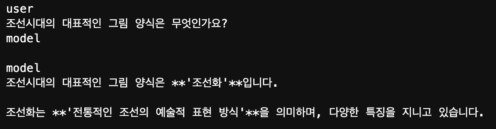

# 🧠 Self-Correcting Model with SCoRe Dataset

This project implements a **Self-Correcting Model** that fine-tunes a large-scale language model on the **SCoRe Dataset**. The model is designed to generate initial answers, self-correct them, and improve its responses using reinforcement learning techniques.

## 📚 Project Overview

- **Model**: The model is based on the `gemma-2-2B-it` architecture, fine-tuned on the SCoRe dataset.
- **Training**: The model undergoes a two-stage training process. In the first stage, the model generates initial answers, and in the second stage, the model self-corrects its answers based on a reward system.
- **Reinforcement Learning**: Reinforcement learning is used to improve the self-correction process by rewarding better answers and penalizing incorrect or unchanged responses.

### 🛠 Key Features

1. **Self-Correction**: The model generates an initial answer (`y1`) and then provides a corrected answer (`y2`) based on feedback. If the corrected answer improves upon the original, a reward is given.
2. **SCoRe Dataset**: The model is trained on the **SCoRe Dataset**, which contains questions, initial answers, and correct answers, allowing the model to learn from both successes and mistakes.
3. **Chat Template**: A `chat_template` is used to structure interactions between the user and the model, making it easier to fine-tune the model for conversational AI tasks.

## 🚀 How It Works

### 1. **Stage I: Initial Answer Generation**
   - The model generates an initial answer (`y1`) based on the input question.
   - **Cross-entropy loss** and **KL-divergence loss** are combined to guide the model to stay close to the original distribution while providing a reasonable answer.

### 2. **Stage II: Self-Correction and Reward Shaping**
   - The model generates a second attempt (`y2`) at answering the question after receiving feedback.
   - **Reward Function**:
     - If the second answer improves upon the first, a reward is given.
     - If no improvement is made, the model is penalized.
     - Partial improvements are also rewarded, but with a lower score.
   - **Shaped Loss** is computed by adjusting the loss based on the reward received for the second answer.

## 📑 Dataset: SCoRe
I created a simple dataset to train on.
The **SCoRe Dataset** is structured with the following columns:
- **question**: The question posed to the model.
- **original_answer**: The initial answer generated by the model.
- **correct_answer**: The true correct answer, used to guide the self-correction process.

### Example:
| question                       | original_answer         | correct_answer                |
|---------------------------------|-------------------------|-------------------------------|
| What is 2 + 2?                  | 2 + 2 = 3               | 2 + 2 = 4                     |
| What is the capital of France?  | Paris is a country       | The capital of France is Paris |

## 🛠 How to Run the Model

1. **Install Dependencies**:
   Ensure you have all the required Python packages installed:
   ```bash
   pip install -r requirements.txt
   ```

2. Run the Training Script: To start training the model, run the train.py script:
    ```bash
    python train.py --config config.yaml
    ```

## Result 
* 산수화가 정답인데 오답을 생성한 모습


* 학습 후 정답을 맞춘 모습


